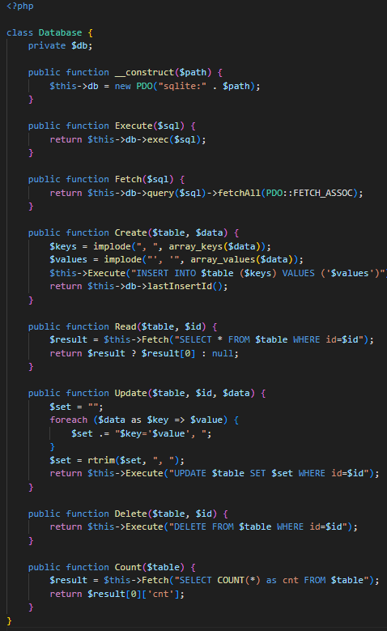
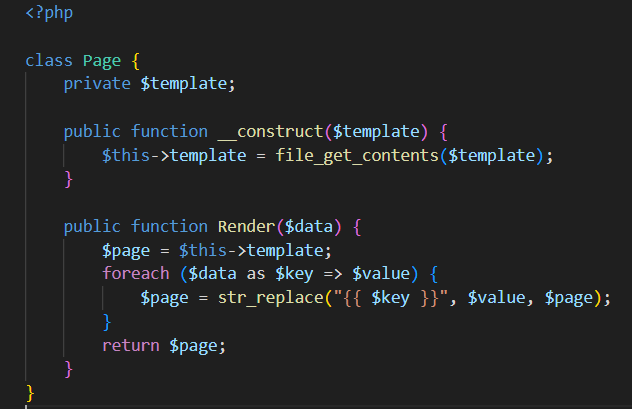
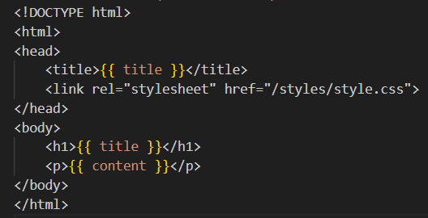
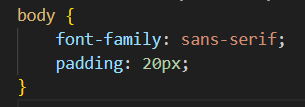
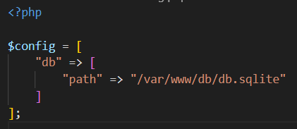
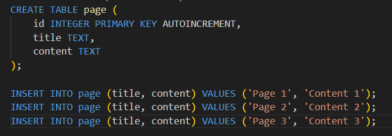
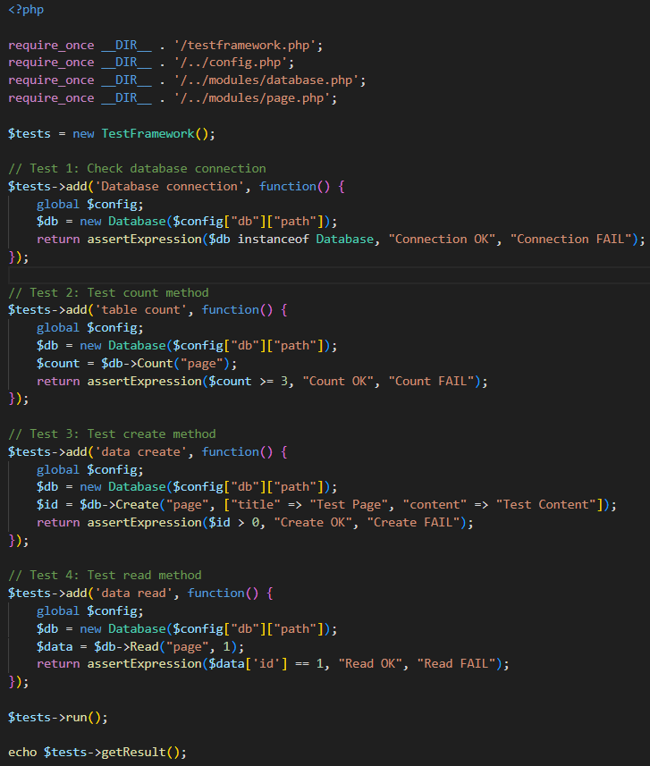
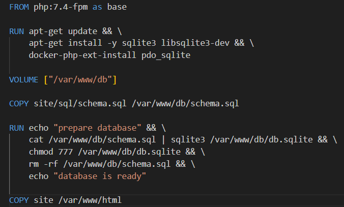
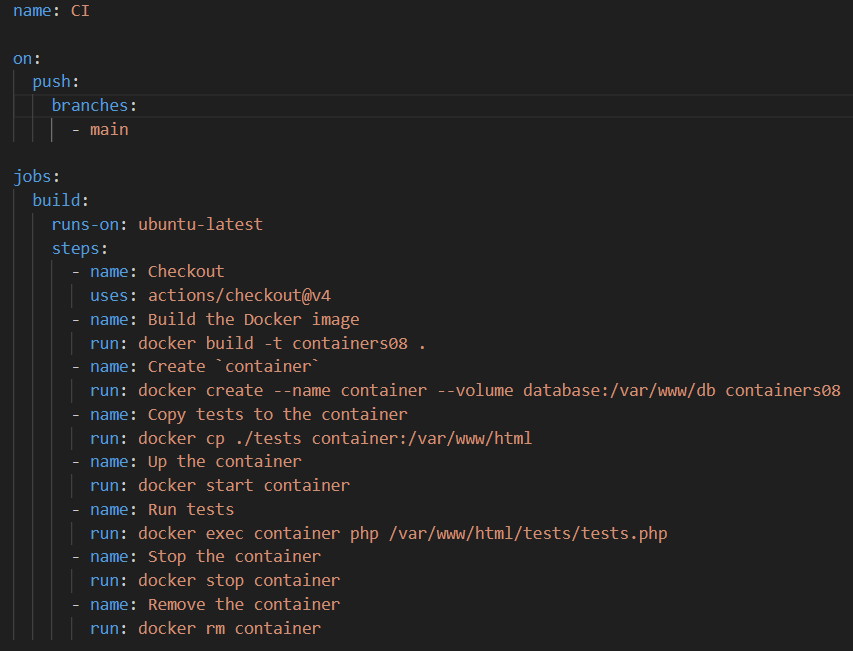
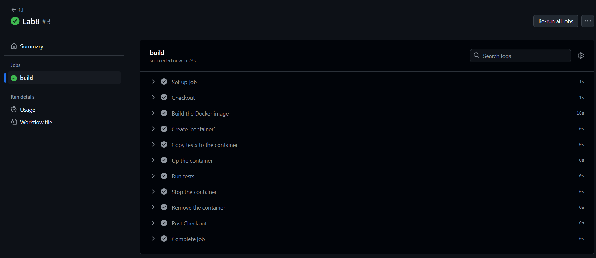

# Lucrare de laborator №8: Integrare continuă cu Github Actions

## Scopul lucrării

De a învăța să configurăm integrarea continuă cu ajutorul Github Actions.

## Sarcina

Crearea unei aplicații Web utilizând PHP, scrierea testelor pentru aceasta și configurarea integrării continue cu ajutorul Github Actions bazată pe containere.

## Descrierea efectuării lucrării

1. **Crearea structurii aplicației**:
   - Directorul `site` conține aplicația web într-o structură organizată cu fișiere pentru modules, templates, styles, `config.php` și fișierul principal `index.php`.
   - Fișierul `modules/database.php` implementează operațiuni CRUD utilizând SQLite.

   

   - Fișierul `modules/page.php` permite afișarea paginilor bazate pe templaturi.

   

   - Directorul `templates` conține șabloanele HTML.

   

   - Directorul `styles` include fișiere CSS.

   

   - Fișierul `config.php` conține setările pentru conectarea la baza de date.

   

2. **Pregătirea bazei de date**:
   - Fișierul `schema.sql` inițializează tabelul `page` cu date de test.

   

3. **Scrierea testelor**:
   - Directorul `tests` conține un cadru de testare minimal și teste pentru metodele claselor `Database` și `Page`.
   - Testele validează conexiunea la bază, operațiunile CRUD și funcționalitatea de redare a paginilor.

   

4. **Crearea containerului Docker**:
   - Fișierul `Dockerfile` definește mediul PHP cu suport SQLite.

   

5. **Configurarea Github Actions**:
   - Fișierul `.github/workflows/main.yml` automatizează:
     - Verificarea codului din branch-ul `main`.
     - Crearea și rularea containerului.
     - Executarea testelor și raportarea rezultatelor.

     

6. **Pornire și testare**:
   - Am trecut la fila Actions în repozitoriu și am așteptat finalizarea sarcinii pentru a mă asigura că testele trec cu succes. Trebuie să arate cu verde dacă a trecut cu succes testele.

   

## Întrebări

### 1. Ce este integrarea continuă?
Integrarea continuă (CI) este un proces automatizat care asigură integrarea frecventă a modificărilor codului într-un proiect comun. Scopul său este să detecteze și să rezolve conflictele sau erorile în cod.

### 2. Pentru ce sunt necesare testele unitare? Cât de des trebuie să fie executate?
Testele unitare verifică funcționarea corectă a unor unități mici de cod, precum funcții sau metode. Ele trebuie executate de fiecare dată când se efectuează modificări în cod sau se adaugă noi funcționalități.

### 3. Care modificări trebuie făcute în fișierul `.github/workflows/main.yml` pentru a rula testele la fiecare solicitare de trage (Pull Request)?
Adăugarea următorul bloc pentru a declanșa workflow-ul într-un context de Pull Request:

```yaml
on:
  pull_request:
    branches:
      - main
```

### 4. Ce trebuie adăugat în fișierul `.github/workflows/main.yml` pentru a șterge imaginile create după testare?
Adăugarea unui pas suplimentar la final pentru a șterge imaginea Docker:

```yaml
      - name: Remove Docker image
        run: docker rmi containers08
```

## Concluzii

Lucrarea de laborator demonstrează importanța integrării continue și a testării automate pentru asigurarea calității software-ului. Utilizarea Docker și Github Actions simplifică procesul de testare și oferă un mediu standardizat pentru rularea aplicațiilor și testelor.
